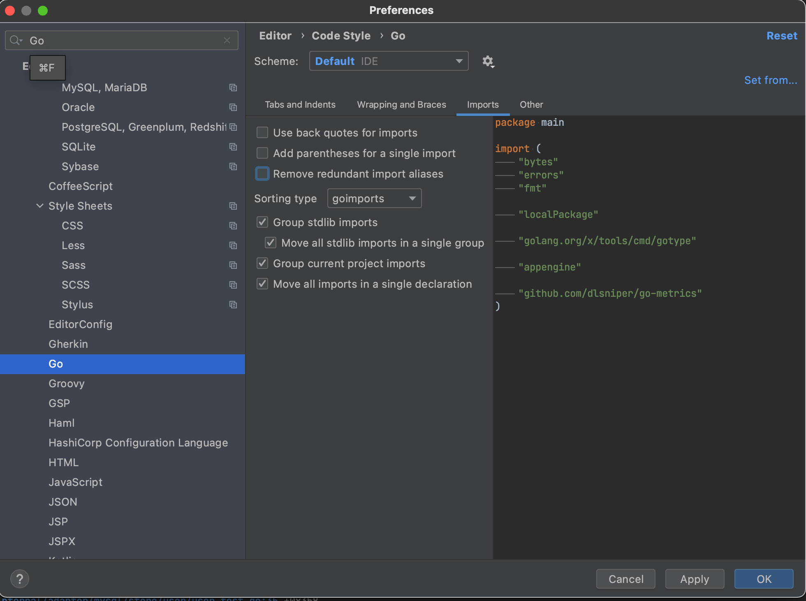
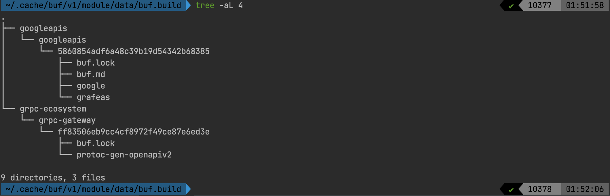
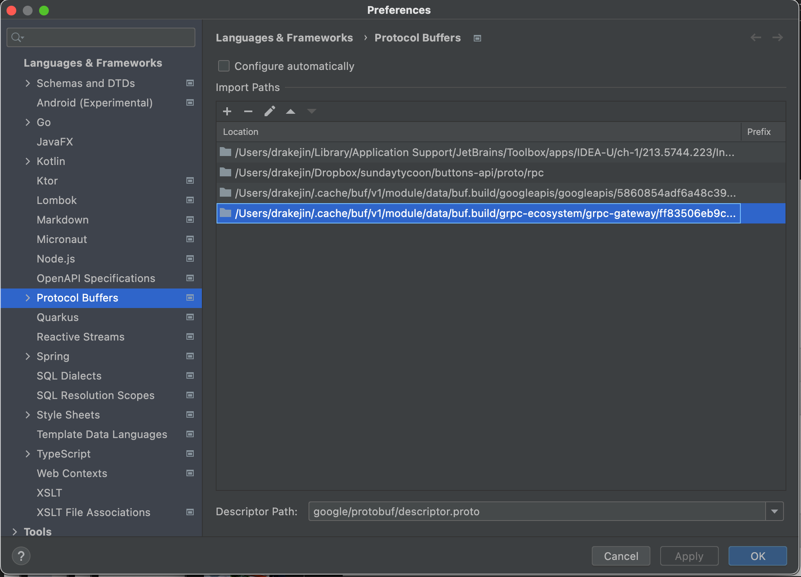

# 개발 환경

### 서버 실행 환경

모든 실행 환경은 **docker**와 **docker-compose**를 기반으로 하고 있기 때문에 **docker**와 **docker-compose**만 설치되어 있으면 돼요.

### IDEA IntelliJ - goimport
goimport룰은 다음과 같이 설정해주세요.



### IDEA IntelliJ - protobuf
- 해당 프로젝트는 buf를 이용합니다. buf로 인한 protobuf셋업을 해주세요.
- buf의 cache는 다음과 같은 위치에 있고, 디렉토리가 해시값에 의해 계속 변경됩니다.
- buf의 모듈을 새로 받을 때 마다 매번 잡아주어야만 합니다.





<!-- 
## 디버깅 환경

### 디버깅

디버깅을 위한 디버깅 서버를 띄워요. `make run`으로 띄운 RDB와 캐시 서버를 같이 사용해요.

```shell
$ make debug
```

- 4000: HTTP 서버
- 4001: GRPC 서버
- 4002: 어드민 서버
- 2345: delve 서버 (디버깅용)

디버깅 서버를 띄운 다음에는 사용하는 에디터나 IDE에서 디버깅 환경을 구성해줘야 해요. IntelliJ 기준으로는 다음과 같이 debug configuration에서 go remote를 추가하여 2345 포트를 등록해주세요.


설정을 마친 후 breakpoint와 함께 IntelliJ의 go remote 디버깅을 시작한 다음 8003 포트로 gRPC API를 호출하면 디버깅이 시작돼요.

레퍼런스: https://mingrammer.com/debugging-containerized-go-app

### 프로파일링

> 준비중

## 커밋 가이드

아주 엄격한 규칙이 있는건 아니지만, 커밋 메시지는 가능하면 [conventional commit](https://www.conventionalcommits.org/en/v1.0.0/)을 따라주세요. ex) **feat(api): implment CreateUser API**

## Lint 가이드

커밋을 하기 전에 `gofmt`, ` go vet`으로 미리 linting 검사를 하면 좋아요. 또한 작업이 끝나면 `go mod tidy` 명령어로 modules를 최신 상태로 유지해주세요.

-->