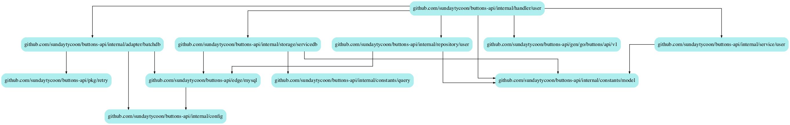

# buttons-api

# wiki

### ent.go 유용한 스크립트 모음

- [Link: Official Refereneces](https://entgo.io/docs/getting-started)

``` markdown
# add model
go run entgo.io/ent/cmd/ent init User

# sync schema
### First, should to modify ent/schema/*.go before synchronizing schema
vi ./ent/schema/*.go # step 1
go generate ./ent # step 2
go run cmd/main.go ent migration # step 3


```

### 개발 셋팅 관련 문서

- [DEVELOPMENT.md](https://github.com/sundaytycoon/buttons-api/blob/main/DEVELOPMENT.md)

### package dependencies

``` makefile
make generate-docs # 요거하면 토드 dependency graph가 바뀌어요
```



# scripts

### protobuf generating

``` bash
make protosetup # For set up protobuf using `buf`

make protogen # For generating protobuf
```

# References

- git: https://github.com/iDevoid/stygis
- meidum: https://medium.com/@matiasvarela/hexagonal-architecture-in-go-cfd4e436faa3
- youtube: https://www.youtube.com/playlist?list=PLGl1Jc8ErU1w27y8-7Gdcloy1tHO7NriL

