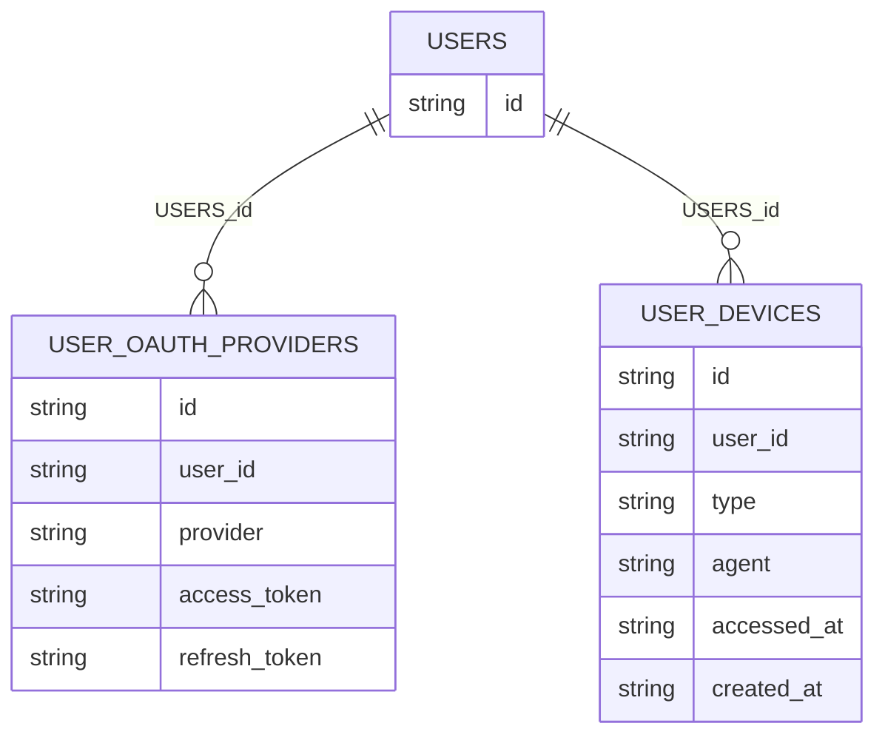
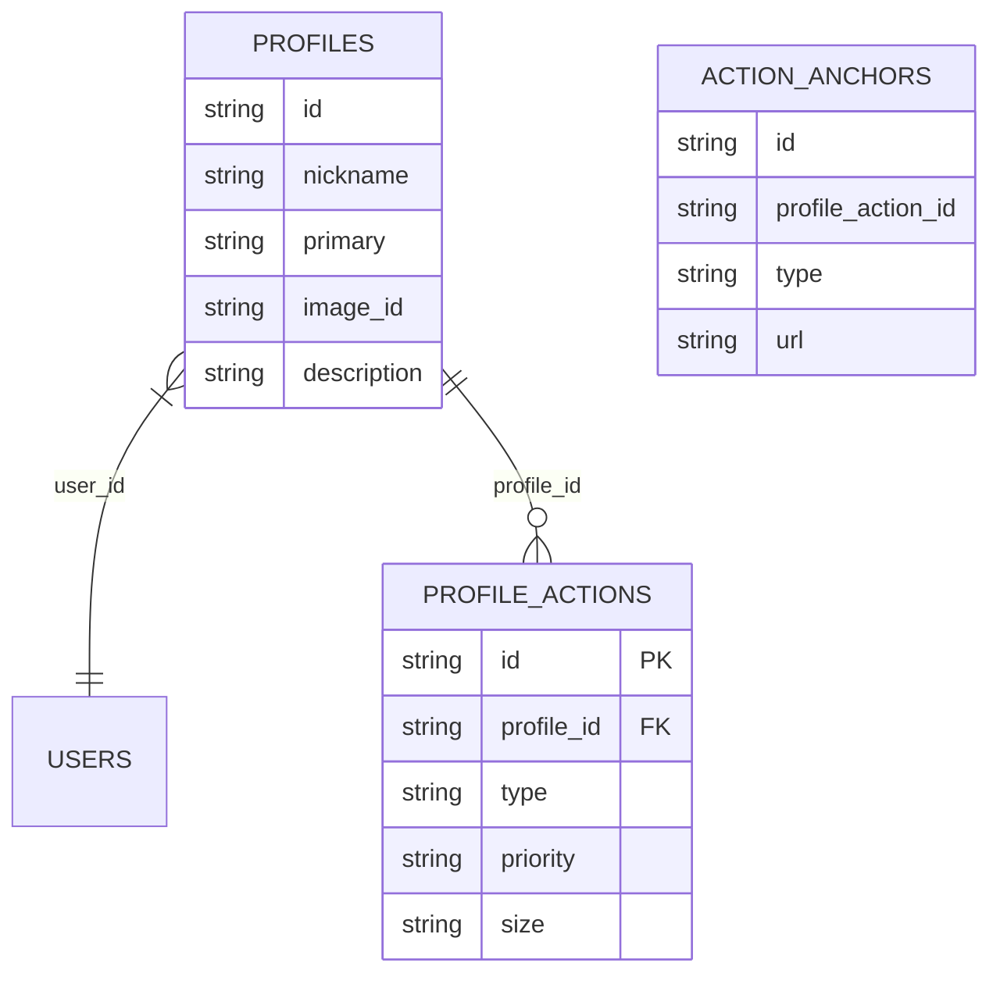

# ERD
### user domains

```mermaid
erDiagram
    USER_OAUTH_PROVIDERS {
        string id
        string user_id
        string provider
        string access_token
        string refresh_token
   }
    USERS ||--o{ USER_OAUTH_PROVIDERS : USERS_id
    USERS {
        string id
    }
    USERS ||--o{ USER_DEVICES : USERS_id
    USER_DEVICES {
        string id
        string user_id
        string type
        string agent
        string accessed_at
        string created_at
    }
```

### profiles domains

```mermaid
erDiagram
    PROFILES }|--|| USERS : user_id
    PROFILES {
        string id
        string nickname
        string primary
        string image_id
        string description
    }
    PROFILES ||--o{ PROFILE_ACTIONS : profile_id
    PROFILE_ACTIONS {
        string id PK
        string profile_id FK
        string type
        string priority
        string size
    }
    ACTION_ANCHORS {
        string id
        string profile_action_id
        string type
        string url
    }
```

### event domains

``` mermaid


```
